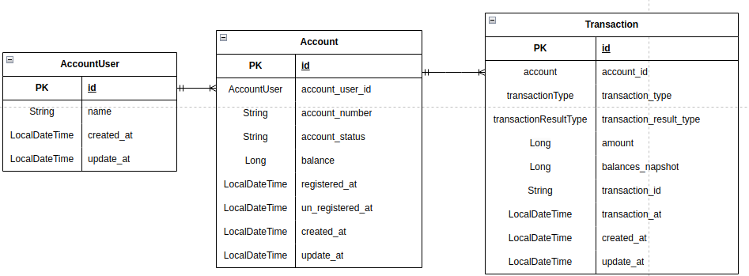

# Spring boot와 Java를 활용하여 Account(계좌 관리) 시스템을 만드는 프로젝트 과제

## 기술
- Spring boot, Java
- H2 DB(memory DB 모드)
- Spring data jpa
- Embedded redis

## 프로젝트 소개
- 사용자와 계좌의 정보를 저장하고 있으며, 외부 시스템에서 거래를 요청할 경우 거래 정보를 받아서 계좌에서 잔액을 거래금액만큼 줄이거나(결제), 거래금액만큼 늘리는(결제 취소) 거래 관리 기능을 제공하는 시스템
- 구현의 편의를 위해 사용자 생성 등의 관리는 API로 제공하지 않고 프로젝트 시작 시 자동으로 데이터가 입력되도록 하며, 계좌 추가/해지/확인, 거래 생성/거래 취소/거래 확인의 6가지 API를 제공  
* 거래금액을 늘리거나 줄이는 과정에서 여러 쓰레드 혹은 인스턴스에서 같은 계좌에 접근할 경우 동시성 이슈로 인한 lost update가 발생할 수 있음 -> AOP - Lock 이용

## Erd

## API
1) 계좌 생성  
a. 파라미터 : 사용자 아이디, 초기 잔액  
b. 결과  
i. 실패 : 사용자 없는 경우(USER_NOT_FOUND), 계좌가 10개(사용자당 최대 보유 가능 계좌) 인 경우(MAX_ACCOUNT_PER_USER_10)   
ii. 성공  - 응답 : 사용자 아이디, 생성된 계좌 번호(10자리 랜덤 숫자), 등록일시(LocalDateTime)  
    
2) 계좌 해지  
a. 파라미터 : 사용자 아이디, 계좌 번호  
b. 결과  
i. 실패 : 사용자 없는 경우(USER_NOT_FOUND), 해당 계좌 없는 경우(ACCOUNT_NOT_FOUND),사용자 아이디와 계좌 소유주가 다른 경우(USER_ACCOUNT_UN_MATCH), 계좌가 이미 해지 상태인 경우(ACCOUNT_ALREADY_UNREGISTERED), 잔액이 있는 경우(BALANCE_NOT_EMPTY)  
ii. 성공 - 응답 : 사용자 아이디, 계좌번호, 해지일시  
3) 계좌 확인  
a. 파라미터 : 사용자 아이디  
b. 결과  
i. 실패 : 사용자 없는 경우(USER_NOT_FOUND)  
ii. 성공  
- 응답 : (계좌번호, 잔액) 정보를 Json list 형식으로 응답  
4) 잔액 사용  
a. 파라미터 : 사용자 아이디, 계좌 번호, 거래 금액  
b. 결과  
i. 실패 : 사용자 없는 경우(USER_NOT_FOUND), 사용자 아이디와 계좌 소유주가 다른 경우(USER_ACCOUNT_UN_MATCH), 계좌가 이미 해지 상태인 경우(ACCOUNT_ALREADY_UNREGISTERED), 거래금액이 잔액보다 큰 경우(AMOUNT_EXCEED_BALANCE), 거래금액이 너무 작거나 큰 경우 (INVALID_AMOUNT), 계좌가 사용중인경우(ACCOUNT_TRANSACTION_LOCK)
ii. 성공  - 응답 : 계좌번호, transaction_result, transaction_id, 거래금액, 거래일시  
5) 잔액 사용 취소  
a. 파라미터 : transaction_id, 계좌번호, 거래금액  
b. 결과  
i. 실패 : 원거래 금액과 취소 금액이 다른 경우(CANCEL_MUST_FULLY), 트랜잭션이 해당 계좌의 거래가 아닌경우(TRANSACTION_ACCOUNT_UN_MATCH), 계좌가 사용중인경우(ACCOUNT_TRANSACTION_LOCK), 트랜잭셔이 없는경우(트랜잭션이 없는 경우)  
ii. 성공  - 응답 : 계좌번호, transaction_result, transaction_id, 취소 거래금액, 거래일시  
6) 거래 확인  
a. 파라미터 : transaction_id  
b. 결과  
i. 실패 : 해당 transaction_id 없는 경우 실패 응답(TRANSACTION_NOT_FOUND)  
ii. 성공  - 응답 : 계좌번호, 거래종류(잔액 사용, 잔액 사용 취소), transaction_result, transaction_id, 거래금액, 거래일시  
- 성공거래 뿐 아니라 실패한 거래도 거래 확인  

